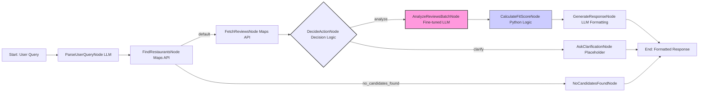

# AI Restaurant Recommender Agent

[](https://opensource.org/licenses/MIT)

An AI-powered agent designed to provide personalized restaurant recommendations based on user preferences, location, and in-depth analysis of user reviews using a specialized fine-tuned language model.

## Features

*   **Natural Language Understanding:** Parses user requests in plain English to extract key details like location, cuisine, budget, vibe, and priorities.
*   **Google Maps Integration:**
    *   Finds relevant restaurants based on location and cuisine.
    *   Fetches up-to-date user reviews for candidate restaurants.
    *   Detects the user's current physical location (via IP geolocation) for distance/travel time calculations.
    *   Retrieves opening hours and status.
*   **Fine-tuned Review Analysis:** Utilizes a custom fine-tuned model ([`c0sm1c9/restaurant-review-analyzer-dutch`](https://huggingface.co/c0sm1c9/restaurant-review-analyzer-dutch)) to analyze reviews and assign scores (1-10) for key dimensions: **Taste**, **Service**, and **Ambiance**.
*   **Personalized Fit Score:** Calculates a weighted "Fit Score" (0-10) for each restaurant based on how well its dimensional scores align with the user's stated priorities.
*   **Structured Output:** Presents recommendations in a clear Markdown format, including:
    *   A comparison table with dimensional scores, fit scores, distance, price level, and review counts.
    *   Concise summaries linking recommendations to user priorities.
    *   Opening hours information, including "Closing Soon" warnings.
    *   A concluding suggestion.

## Architecture

The agent is designed as a graph of connected nodes, with each node performing a specific task and sharing data via a central store. This approach allows for modular, maintainable, and flexible application design.



**Core Technologies:**

*   **Language:** Python 3.x
*   **LLMs:**
    *   General Purpose LLM (e.g., OpenAI GPT-4o-mini) for query parsing and response generation (via `utils/call_llm.py`).
*   **Review Analysis:** Local execution of a fine-tuned model using Hugging Face `transformers` and `torch` (via `utils/analyze_reviews.py` or similar).
*   **APIs:** Google Maps Places API
*   **Libraries:** `transformers`, `torch`, `googlemaps`, `openai`, `requests`, `python-dotenv`, `ipinfo`

## Fine-tuned Review Analysis Model

A key component is the fine-tuned model [`c0sm1c9/restaurant-review-analyzer-dutch`](https://huggingface.co/c0sm1c9/restaurant-review-analyzer-dutch) hosted on Hugging Face.

*   **Base Model:** XLM-RoBERTa-Base
*   **Task:** Multi-head regression trained primarily on Dutch restaurant reviews.
*   **Output:** Predicts scores (1-10) for **Taste**, **Service**, and **Ambiance**.
*   **Integration:** The agent loads and runs this model **locally** using the Hugging Face `transformers` library and a custom Python class defined within the project (similar to the usage example on the model's Hugging Face page). This requires installing the `transformers` and `torch` libraries. Model weights might be downloaded automatically by the library on first run or may need to be present in the repository/cache.

## Getting Started

### Prerequisites

*   Python 3.8+
*   Git
*   PyTorch (`torch`)
*   Hugging Face Transformers (`transformers`)
*   Access to Google Maps Places API
*   Access to an OpenAI API key (or compatible LLM provider)

### Installation

1.  **Clone the repository:**
    ```bash
    git clone https://github.com/haitao-t/AI_restaurant_recommender_Agent.git
    cd AI_restaurant_recommender_Agent
    ```

2.  **Create and activate a virtual environment:**
    ```bash
    python3 -m venv venv
    source venv/bin/activate  # On Windows use `venv\Scripts\activate`
    ```

3.  **Install dependencies:**
    ```bash
    pip install -r requirements.txt
    ```
    *(Note: Ensure `requirements.txt` includes libraries like `googlemaps`, `openai`, `requests`, `python-dotenv`, `ipinfo`, `torch`, `transformers`)*

4.  **Set up environment variables:**
    Create a file named `.env` in the project root directory and add your API keys:
    ```dotenv
    # .env file
    GOOGLE_MAPS_API_KEY="YOUR_GOOGLE_MAPS_API_KEY"
    OPENAI_API_KEY="YOUR_OPENAI_API_KEY"

    # Optional: Override default LLM model for general tasks
    # DEFAULT_LLM_MODEL="gpt-4o-mini"
    ```
    *   Get a Google Maps API key from the [Google Cloud Console](https://console.cloud.google.com/apis/library/places-backend.googleapis.com). Ensure the Places API is enabled.
    *   Get an OpenAI API key from the [OpenAI Platform](https://platform.openai.com/).

## Usage

Run the main application script:

```bash
python main.py
```

The application will prompt you to enter your restaurant request.

**Example Query:**

```
Find me a great Italian place in Soho for a date night, budget around £60pp, focus on ambiance and good service.
```

**Expected Output:**

The agent will process the request through the defined workflow and output a Markdown formatted response containing:

*   An introductory sentence acknowledging the request.
*   A comparison table of the top recommended restaurants, showing:
    *   Name
    *   Distance/Travel Time (from your current location)
    *   Price Level
    *   Dimensional Scores (Taste, Service, Ambiance) with star emojis (⭐)
    *   Calculated Fit Score
    *   Review Count Analyzed
    *   Opening Hours / Status
*   A concise summary highlighting why the recommendations fit the user's priorities.
*   A concluding remark.

## Project Structure

```
├── .env.example        # Example environment variables file
├── README.md           # This file
├── docs/
│   └── design.md       # Detailed design document
├── main.py             # Main application entry point
├── flow.py             # Defines the workflow graph
├── nodes.py            # Implementation of individual workflow nodes
├── requirements.txt    # Python dependencies
└── utils/
    ├── __init__.py
    ├── call_llm.py     # Utilities for calling the general LLM (OpenAI)
    ├── analyze_reviews.py # Utility for loading and running the local fine-tuned model
    └── google_maps_api.py # Utilities for interacting with Google Maps API
```

## Acknowledgements

This project was developed by:
*   Haitao Tao
*   Yihan Shen
*   Zegeng Zhu

## License

This project is licensed under the MIT License - see the [LICENSE](LICENSE) file for details.

This project uses [PocketFlow](https://github.com/The-Pocket/PocketFlow), which is also licensed under the MIT License. 